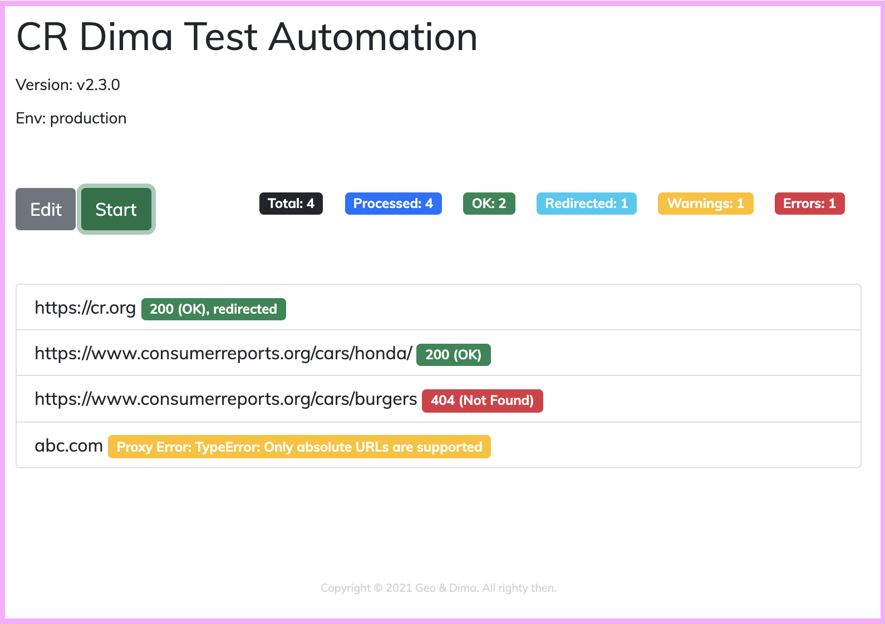

# CR DIMA TEST

Ping a list of URLs to ensure they are alive.

http://cr-dima-test.herokuapp.com/

# TODO

1. record speed/time

# Version History

### v2.4.0
Feb-13, 2021
* add button and spinner for each row

### v2.3.1
Feb-12, 2021
* update header looks
* add github link
* hide env for prod

### v2.3.0
Feb-12, 2021
* add footer
* hide sum badge if number is 0
* check for redirects (301 or 302)

### v2.2.0
Feb-12, 2021
* speed up fetch by fetching headers only (no content). Replaced the GET method with HEAD in the server proxy. Need to confirm whether it actually improved anything?
* add summary count numbers

### v2.1.0
Feb-12, 2021
* highlight 200 as green, error code (404, 500) as red, anything else as yellow.

### v2.0.0
Feb-11, 2021
* Added bootstrap

### v1.1.0
Feb-11, 2021
* Added ability to edit the list of URLs.

### v1.0.0
Feb-10, 2021
* Init version with a static list.
